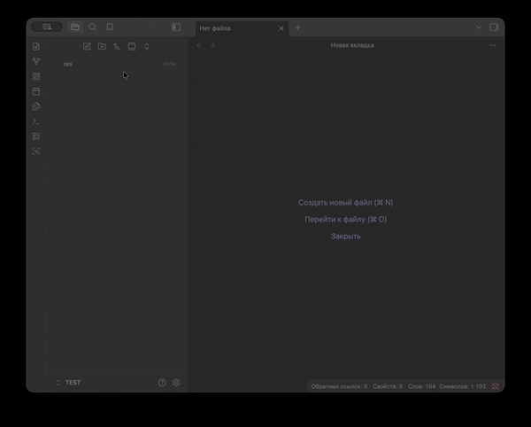

# FFUF Parser — плагин для Obsidian


Парсит результаты [ffuf](https://github.com/ffuf/ffuf) и превращает их в markdown-таблицу в vault.

## Поддерживаемые форматы

| Как получить | Формат |
|---|---|
| `ffuf ... -o scan.json -of json` | JSON-файл с массивом `results` |
| `ffuf ... -json 2>/dev/null` | NDJSON (одна строка = один результат) |
| Обычный stdout без `-json` | Текстовые строки `[Status: 200, Size: ...]` |

## Установка для разработки

```bash
npm install
npm run dev
```

После `npm run build` скопируйте **содержимое папки `dist/`** в `.obsidian/plugins/obsidian-ffuf/` вашего vault (`main.js` + `manifest.json`).

`manifest.json` не генерируется сборкой — это исходный файл в корне проекта; `npm run build` дополнительно копирует его в `dist/` вместе с `main.js`.

В Obsidian: **Settings → Community plugins → FFUF Parser**.

## Использование

1. Сохраните вывод ffuf как `.json`, `.ndjson` или `.txt` в vault.
2. **ПКМ по файлу** в проводнике → **Обработать как FFUF** — откроется markdown-заметка с таблицей (JSON в Obsidian открывать не нужно).
3. Либо команда **Parse ffuf: active file** / **Parse ffuf: clipboard**.

По умолчанию создаётся **структура только по найденным URL** в ffuf:

```
books.toscrape.com/
├── index.md
├── ffuf-2026-05-20.md   ← таблица скана
├── media/index.md       → http://books.toscrape.com/media/
├── static/index.md      → http://books.toscrape.com/static/
└── catalogue/index.md   → http://books.toscrape.com/catalogue/
```

После обновления плагина в уведомлении будет **FFUF v0.3.1**. Если видите папки `img/`, `photo/` — в vault старая версия `main.js`, удалите её и скопируйте заново из `dist/`.

`https://…` в результатах нормализуется в `http://host/path/`. Файлы вроде `/static/main.css` дают папку `static/`, а не `main.css`.

## Пример команды ffuf

```bash
ffuf -u https://target/FUZZ -w wordlist.txt -o scan.json -of json
```

```bash
ffuf -u https://target/FUZZ -w wordlist.txt -json 2>/dev/null | tee scan.ndjson
```

## Сборка

```bash
npm run build
```
# obsidian-ffuf-extension
